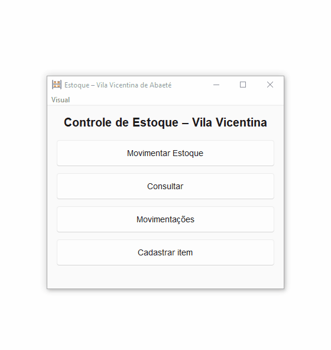

# 📦 Sistema de Controle de Estoque -- Vila Vicentina Abaeté

Aplicação desktop desenvolvida em **Python** para controle de estoque de
doações da **Vila Vicentina de Abaeté**.

O projeto surgiu a partir de uma necessidade real: organizar entradas e
saídas de alimentos e itens doados, evitar perdas por falta de controle
e facilitar o acompanhamento de estoque mínimo no dia a dia da
instituição.

## 🎥 Demonstração do sistema

------------------------------------------------------------------------

## 🎯 Objetivo do projeto

Criar uma aplicação simples, estável e prática para uso real, sem exigir
conhecimento técnico do usuário final.

O foco principal não foi "mostrar tecnologia", mas sim **resolver um
problema concreto**, com uma interface direta, fluxo intuitivo e dados
persistentes de forma segura.

------------------------------------------------------------------------

## 🧾 Funcionalidades

-   Cadastro de itens\
-   Entrada e saída de estoque\
-   Dashboard com visão geral\
-   Histórico de movimentações com exportação CSV/Excel\
-   Relatórios por período\
-   Inventário guiado

------------------------------------------------------------------------

## ✅ Como testar (Windows)

1.  Acesse a aba **Releases** deste repositório\
2.  Baixe o arquivo `.zip` da versão mais recente\
3.  Extraia a pasta\
4.  Execute `EstoqueONG.exe`

Os dados são salvos automaticamente em:

    %APPDATA%\EstoqueONG

------------------------------------------------------------------------

## 🖥️ Interface (GUI)

-   Desenvolvida com **Tkinter**
-   Busca inteligente com:
    -   rolagem de resultados\
    -   filtro por início do nome\
    -   filtro por conteúdo\
-   Pensada para usuários sem familiaridade com sistemas complexos

------------------------------------------------------------------------

## 🧱 Arquitetura

-   `gui.py` → Interface gráfica\
-   `estoque_core.py` → Regras de negócio\
-   `api.py` → Estrutura para camada de serviço futura

### Princípios:

-   Core como fonte única de verdade\
-   Interface desacoplada\
-   Persistência segura\
-   Estrutura preparada para crescimento

------------------------------------------------------------------------

## 🔗 Camada de serviço (em evolução)

Estrutura preparada com **FastAPI** para futuras integrações como:

-   rede local\
-   aplicações web\
-   relatórios externos

Atualmente o core centraliza toda a lógica.

------------------------------------------------------------------------

## 📦 Distribuição

Aplicação empacotada em `.exe` com **PyInstaller**.

------------------------------------------------------------------------

## 🧠 Aprendizados

-   Arquitetura em camadas\
-   Refatoração real\
-   Persistência desktop\
-   Build e distribuição\
-   Organização de projetos

------------------------------------------------------------------------

## 🛠️ Tecnologias

-   Python\
-   Tkinter\
-   FastAPI\
-   PyInstaller\
-   Git

------------------------------------------------------------------------

## 📌 Status

Sistema funcional em uso de testes e pronto para evoluções.
